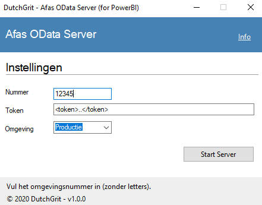
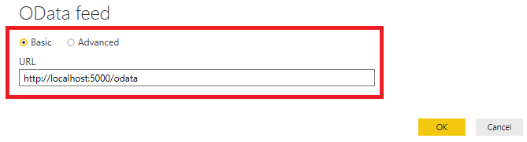
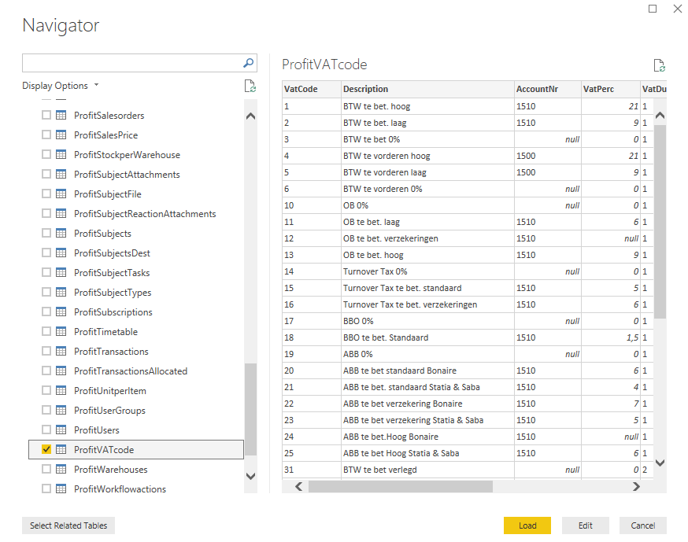

# DutchGrit - Afas OData Server - for Power BI

> Note: version 1.0.0 can cause an meaningless Unauthorized message. See this [issue](https://github.com/dutchgrit/afasodataserver/issues/1)  

The DutchGrit Afas OData Server is a (free) Desktop application which forms a easy to use connection between Power BI and the Online Afas GetConnector API's. The only thing you need is your Afas number and a valid Token, which is a lot easier!

The application automaticly detects the available GetConnectors attached to your token and translates any OData query into GetConnector API call's on the fly. 

> The application acts as a bridge. No data is stored or preloaded. 

When PowerBI has loaded the data, you can close this application and you can share your PowerBI report with everyone (including the loaded data), upload it to the Online PowerBI to share the PowerBI dataset there, etc. Whenever you need to 'refresh' the data, you startup this application again and perform a refresh. For use cases where frequent and/or automatated refresh is necessary, use our hosted variant (see below).  

## Usage

1. Download the application from the [release](https://github.com/dutchgrit/afasodataserver/releases) tab above. Choose the approriate x86 (32 bit) or x64 (64 bit) release. The files are big because we ship the .NET Core 3.1 framework along with it for convenience. Extract the zip file and look for the `AfasODataApp.exe` application. 

2. Fill in you number and token and hit Start Server.

Wait for the message that server is started. You can find it at http://localhost:5000/odata

3. Start Power BI Desktop, Get Data and choose OData Feed.
Supply the OData endpoint

4. Preview, select and load all your GetConnectors at once.

## OData Server details

If you want to use the OData Server outside the context of Power BI, it is useful to know which OData Query options are provided.

The following OData query options are implemented and delegated automaticly to the GetConnector API:

- `$top` 
    - We set a maximum top of 10000. 
- `$skip` 
- `$orderBy` 

A `$skip` without `$top` is not supported.

The following OData options are implemented, but handled locally (after the GetConnector has send it's data) 

- `$select`
- `$filter` 
    - we have plans to delegate the filter as well.

Sample (assuming that ProfitVATcode is included in your GetConnectors) 

http://localhost:5000/odata/ProfitVATcode?$skip=10&$top=10

http://localhost:5000/odata/ProfitVATcode?$orderBy=Description

http://localhost:5000/odata/ProfitVATcode?$filter=VatType%20eq%20%27V%27

## Troubles

Please leave an issue at this Github repository or contact us at [DutchGrit](https://www.dutchgrit.nl).

Known issues 
- You need to restart the application whenever you change your GetConnectors. The application only reads the definitions on start.
- Some connectors are SLOW : be carefull with some of the built-in connectors like: ProfitPeriodeBalance, ProfitPeriodsPerAdministration.

## Other usage

If you need to refresh your data automaticly, please contact [us](https://www.dutchgrit.nl/contact) for a hosted option! In the hosted solution, you can use the PowerBI built-in refresh.  

For other usages (such as : integrations, source code, etc.), please contact us. 

